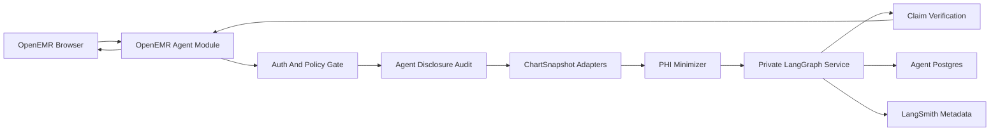
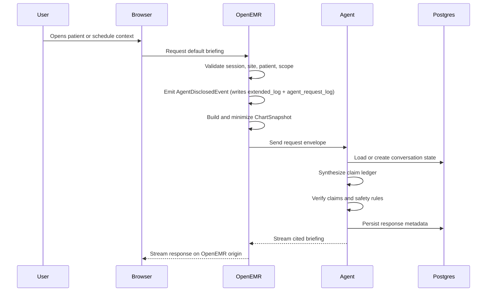
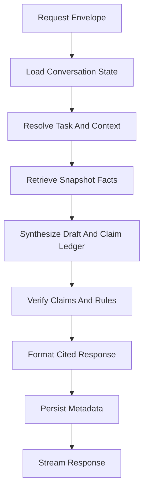
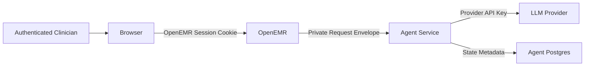

# Architecture: Clinical Co-Pilot

## Summary

Clinical Co-Pilot is a read-only AI agent embedded in OpenEMR for the 90-second pre-visit workflow described in `USER.md`. Its primary user is a family medicine physician who needs a fast, source-cited briefing before entering the exam room: appointment context, patient identity, active diagnoses, current medications, recent labs, allergies, and recent encounters. The agent supports follow-up questions within that patient context, but it is not a general medical chatbot and it does not take clinical actions.

The system is split into two bounded parts. OpenEMR owns the clinical boundary: user session, site context, patient context, authorization, chart reads, data normalization, PHI minimization, and disclosure audit. A private Node/TypeScript LangGraph service owns the agent runtime: graph orchestration, LLM calls, claim ledger generation, verification, response formatting, persistence of agent state, observability, and cost tracking. The browser talks only to OpenEMR; the agent service is not public.

The model-facing data contract is a minimized, typed `ChartSnapshot`, not raw SQL rows and not broad FHIR bundles. OpenEMR builds the snapshot through agent-specific adapters that read from OpenEMR services, FHIR resources, or legacy tables as needed, then normalize dates, identifiers, code labels, missing data, and source references. This keeps OpenEMR's legacy schema and PHI-heavy records away from the LLM surface.

Every response passes through verification before display. The graph produces a structured claim ledger where each factual claim has a source reference. Deterministic verification checks structured facts such as medication names, dosages, allergies, lab values, dates, and source availability. LLM verification may be used only for bounded semantic checks against cited text. Unsupported claims are stripped. Missing safety-critical data, especially allergies and active medications, fails closed and is shown as an explicit gap rather than being silently omitted.

The MVP deployment uses a single DigitalOcean Droplet running docker-compose: OpenEMR, MariaDB for OpenEMR, a private LangGraph service, Postgres for agent state, and Caddy as a reverse proxy with Let's Encrypt TLS. This deployment is appropriate for demo data and the project timeline. Real PHI would require signed BAAs, hardened TLS/HSTS, retention policy, centralized audit operations, stronger patient/encounter authorization, production incident response, and a move to dedicated infrastructure per service (managed databases, separate compute for the agent runtime, object storage for documents).

This document describes the architecture as the implementation reference. The user workflow is defined in `USER.md`, the presearch rationale is captured in `docs/PRESEARCH.md`, and the OpenEMR constraints behind these decisions are documented in `AUDIT.md`.

---

## Architectural Principles

- **OpenEMR is the clinical system of record.** The agent reads from OpenEMR and cites OpenEMR records; it does not maintain independent clinical truth.
- **The agent is read-only.** It does not diagnose, prescribe, place orders, write notes, send messages, or update the chart in this version.
- **The browser has one trust boundary.** Users authenticate to OpenEMR, and all browser traffic stays on the OpenEMR origin.
- **The LLM receives minimized clinical context.** It never receives raw database rows, broad patient API payloads, OpenEMR session cookies, or full chart exports.
- **Claims must be source-backed.** A clinical fact that cannot be traced to a source record does not reach the clinician as fact.
- **Safety-critical gaps are visible.** Missing allergy, medication, interaction, or dosage-relevant data fails closed.
- **Audit is explicit and dual-purpose.** Each agent request fires one Symfony event consumed by one listener that writes to two tables: OpenEMR's existing `extended_log` (regulatory trail, deduped per actor/patient/day, surfaces in §164.528 reports) and a new `agent_request_log` (engineering instrumentation, per-request granularity, structured for cost/eval queries). Both writes are independent of optional OpenEMR query or API logging settings. Neither stores prompt or completion content.
- **Evals are part of the architecture.** Correctness, authorization, prompt-injection resistance, and failure behavior are tested continuously.

---

## Component Overview



| Component | Runtime | Responsibility |
|---|---|---|
| Browser UI | OpenEMR page/module frontend | Displays briefings, citations, suggested follow-ups, streaming status, and failure messages |
| OpenEMR agent module | PHP custom module | Entry points, route registration, frontend injection, request proxy, policy gate, snapshot construction, disclosure audit |
| Chart adapters | PHP service classes | Typed reads from OpenEMR data sources with normalization and source references |
| PHI minimizer | PHP service class | Drops identifiers and fields not needed for the requested task |
| LangGraph service | Node/TypeScript private service | Agent graph, LLM calls, claim ledger, verification, response formatting, state persistence |
| Agent Postgres | Postgres container on the Droplet (Docker private network) | Conversation state, claim ledgers, source references, verification outcomes, token/cost metadata |
| LangSmith | External observability | LLM and graph metadata only; no PHI prompt/completion bodies |
| OpenEMR MySQL | MariaDB container on the Droplet (Docker private network) | OpenEMR source of record |
| Caddy reverse proxy | Container on the Droplet (binds 80/443) | Public TLS termination with Let's Encrypt; routes `emr.biograph.dev` to the OpenEMR container over Docker's private network |

---

## OpenEMR Integration

The OpenEMR side ships as a custom module under `interface/modules/custom_modules/`. The module should explicitly register its listeners and routes rather than relying on broad container auto-discovery. This keeps the agent isolated from core legacy code and reduces merge friction with upstream OpenEMR.

The module owns four integration surfaces:

- **UI entry points:** Add patient-chart and schedule access through OpenEMR menu, patient menu, or script/header events where supported.
- **Agent HTTP route:** Register module routes through OpenEMR REST extension events where possible, rather than editing `apis/routes/_rest_routes_standard.inc.php` directly.
- **Policy and snapshot services:** Validate requests, create typed `ChartSnapshot` payloads, minimize PHI, and emit disclosure audit.
- **Proxy/streaming bridge:** Forward authorized requests to the private LangGraph service and stream responses back to the browser.

The preferred MVP UI is patient-context launch plus a module-hosted panel. The product target remains a native-feeling embedded panel in patient and schedule workflows, because the default briefing should appear from context rather than from a manually typed prompt.

---

## Runtime Request Flow

### Default Briefing



### Follow-Up Question

Follow-up questions reuse the current patient-bound conversation. The browser sends the question and conversation ID to OpenEMR. OpenEMR validates that the conversation belongs to the acting user, current site, and current patient before forwarding anything to the agent. If the follow-up requires additional chart categories, OpenEMR builds a new minimized snapshot for those categories and dispatches a new `AgentDisclosedEvent`.

Conversations are scoped to one `(user, patient)` pair (locked decision; see `docs/IMPLEMENTATION_PLAN.md`). This reduces cross-patient leakage risk and keeps citations, verification, and audit review simple. The regulatory dedup in `extended_log` keys on `(actor, patient, day)`, so a follow-up against the same conversation on the same day does not produce a second `extended_log` row even though it does produce a second `agent_request_log` row.

---

## Data Contracts

### Request Envelope

OpenEMR sends the agent service a request envelope:

```json
{
  "conversationId": "opaque-browser-session-scoped-id",
  "requestId": "server-generated-request-id",
  "siteId": "default",
  "actor": {
    "userId": "openemr-user-id",
    "role": "physician"
  },
  "patient": {
    "pid": 123,
    "uuid": "patient-uuid"
  },
  "task": "default_briefing",
  "chartSnapshot": {}
}
```

The envelope contains no OpenEMR session cookie, no browser-held OAuth token, and no LLM provider secret.

### ChartSnapshot

`ChartSnapshot` is the model-facing clinical context. It is intentionally smaller than a chart export:

- appointment context for the current visit;
- display-safe demographics;
- active diagnoses relevant to the briefing;
- current medications and recent medication changes;
- allergies and intolerance records;
- recent lab observations with dates, units, reference ranges, and abnormal flags;
- recent encounters with date, type, and source-backed summary fields;
- source references for every clinical fact.

Excluded by default:

- SSN;
- driver's license;
- full street address;
- phone and email unless directly needed;
- non-unique MRN/`pubpid` except as display text;
- billing-only data;
- unrelated family/contact fields;
- full historical chart content outside the requested window.

### Source Reference

Every adapter item carries source metadata:

```json
{
  "source": {
    "system": "openemr",
    "recordType": "MedicationRequest",
    "recordId": "source-record-id",
    "field": "dosageInstruction",
    "recordedAt": "2026-04-20"
  }
}
```

The UI uses these references to render citations and to link back to OpenEMR records where practical.

---

## Tool And Adapter Layer

The LangGraph service exposes a small tool surface to the graph. Tools operate on snapshots or call back to OpenEMR agent endpoints; they do not query MySQL directly.

| Tool | Source Adapter | Purpose | Failure Behavior |
|---|---|---|---|
| `get_patient_context` | Patient and condition adapters | Display-safe identity, active diagnoses, allergies | Fails closed if allergy data cannot be verified |
| `get_recent_labs` | Observation/lab adapter | Labs in the relevant lookback window | Fails open with explicit gap unless needed for a safety rule |
| `get_medications` | Medication adapter | Active meds, doses, routes, start/stop/change evidence | Fails closed |
| `get_recent_encounters` | Encounter/forms adapter | Recent visit dates, reasons, source-backed summaries | Fails open with explicit gap |
| `get_todays_schedule` | Appointment/schedule adapter | Acting clinician's schedule and patient launch context | Fails closed on scope ambiguity |

Adapters are responsible for OpenEMR-specific normalization:

- treating `pid` and UUID as identity and `pubpid` as display-only;
- handling `0000-00-00` and empty dates as unknown dates;
- resolving list option/code labels where possible;
- preserving source IDs for citation;
- returning explicit missingness instead of empty strings;
- refusing ambiguous patient context.

FHIR remains useful inside this layer because it provides a portable resource shape. It is not the model-facing boundary.

---

## LangGraph Agent Runtime

> **Note (W2 update, 2026-05-04):** This section describes the W1 graph as built — small and deterministic, with rule-based routing on the conditional edges after `Retrieve`. **W2 replaces this with an LLM-driven supervisor loop and model-driven retrievers** (see `W2_ARCHITECTURE.md` §"Conversational Graph"). Determinism in W2 is preserved only where it is load-bearing for safety: the verifier, the hard clinical stops, the ingestion pipeline, and the first chart-fetch invocation. The shift is deliberate — non-determinism is the agentic-systems lesson the W2 assignment tests, and structural constraints (closed-enum tool surface, structured-output coercion, required rationale per decision, iteration cap, full LangSmith instrumentation) are what make the LLM-driven shape defensible. The W1 deterministic shape was the right call for the W1 sprint scope; the W2 shape supersedes it.

The MVP graph is intentionally small and deterministic:



### Node Responsibilities

| Node | Responsibility |
|---|---|
| `LoadState` | Load conversation history and patient-bound context from Postgres |
| `PlanContext` | Classify default briefing vs. follow-up and determine needed chart categories |
| `Retrieve` | Read from the provided snapshot or request additional minimized context through OpenEMR |
| `Synthesize` | Produce draft response and structured claim ledger |
| `Verify` | Check source support, hard clinical rules, malformed output, and prompt-injection residue |
| `Format` | Produce clinician-facing answer with citations and explicit gaps |
| `Persist` | Store state, metadata, claim ledger, token usage, cost, and verification result |

The retrieval and verification responsibilities are separated so verification cannot be skipped by a successful-looking draft answer.

---

## Verification Architecture

Verification is a gate between model output and user display.

### Claim Ledger

Each factual claim has:

- claim ID;
- claim text;
- category, such as medication, lab, allergy, diagnosis, encounter, appointment;
- source references;
- safety-critical flag;
- verification status;
- reason when rejected.

Claims without source references are rejected.

### Deterministic Checks

Structured facts are verified without an LLM where possible:

- medication name, status, dose, route, and timing;
- lab value, unit, reference range, abnormal flag, and date;
- allergy substance and reaction;
- encounter date and type;
- appointment date and reason;
- patient identity and current context.

### LLM-Bounded Checks

The verifier may use an LLM to compare a natural-language claim against cited note text. The verifier must receive only the cited source excerpt, not the full chart, and must return a structured pass/fail decision with a reason.

### Safety Rules

- Allergies must always be represented if available.
- Current medications must be verified before medication summaries are shown.
- Interaction and dosage-sensitive warnings are hard stops when present.
- Unsupported or malformed claims are stripped.
- Missing safety-critical data is shown as a failure to verify, not hidden as an omission.

---

## Security And Authorization

### Trust Boundaries



The browser never receives agent service credentials, bearer tokens for the agent service, database credentials, or LLM API keys.

### OpenEMR Policy Gate

Before any chart data is sent to the agent service, OpenEMR verifies:

- authenticated OpenEMR session;
- request site matches active site;
- patient context uses `pid` or UUID;
- acting user has access to the requested patient and data categories;
- request is read-only;
- consent/disclosure policy is satisfied for the environment;
- requested task maps to a supported use case.

OpenEMR's existing session, OAuth/FHIR scopes, and GACL checks are used where appropriate, but the agent module does not assume they are sufficient by themselves. Agent endpoints repeat explicit site, patient, and data-category checks.

### Agent Service Boundary

The agent service accepts traffic only from OpenEMR over the private network. In production, the proxy hop should also use a shared internal secret or mTLS if private networking alone is not considered sufficient. The service rejects requests without a valid request envelope.

### Callback Tools

The preferred MVP is snapshot-first: OpenEMR gathers and minimizes context before invoking the agent. If the agent needs callback tools, those callbacks go only to agent-specific OpenEMR endpoints with short-lived, minimum-scope credentials and the same disclosure-audit behavior.

---

## Audit, PHI, And Compliance Controls

This project uses demo data, but the architecture treats chart content as PHI-equivalent.

### Disclosure Audit

OpenEMR dispatches `AgentDisclosedEvent` (`OpenEMR\Modules\ClinicalCopilot\RequestLog\AgentDisclosedEvent`, handle `agent.phi.disclosed`) before model-bound chart content leaves OpenEMR. The event carries an immutable `AgentDisclosure` value object — never raw prompt or completion text — recording:

- acting user ID and `fhirUser` SMART URI;
- site;
- patient `pid` and UUID;
- conversation ID;
- request ID (derived from the JWT `jti` for idempotency);
- action;
- data categories disclosed (alphabetically sorted for stable fingerprinting);
- destination service;
- timestamp.

A single listener (`AgentDisclosureListener`) consumes the event and writes to two tables. Each write is independent — a failure in one does not block the other or the request flow.

**1. Regulatory trail — OpenEMR's existing `extended_log`** (via `ExtendedLogDisclosureRecorder`).

The recorder writes one row per `(actor, patient, day)`: a clinician opening the same chart 30 times in one day produces one row, not 30. Schema fields used: `event = 'disclosure-ai-treatment'` (a new `list_options.disclosure_type` entry seeded by `db/Migrations/Version20260430000001`, sequence 40 — placed alongside the upstream Treatment / Payment / Health Care Operations options at 10/20/30); `recipient = 'Clinical Co-Pilot Agent'`; `description` is a hand-built category summary (e.g. `"AI-assisted briefing accessed chart categories: allergy, diagnosis, medication"`) — never prompt or completion text.

The row surfaces in the patient summary's Disclosures view (the page driven by `interface/patient_file/summary/disclosure_full.php`) and in any HIPAA Accounting of Disclosures (§164.528) report. Compliance officers see a self-identifying row by recipient and a scannable type column; they can filter to non-AI disclosures by type.

**HIPAA classification:** The clinician-invoked, BAA-mediated, current-patient call is a *use for treatment* under 45 CFR §164.506(c). The transmission to the BA is excluded from §164.528 accounting by §164.528(a)(1)(i). We log to `extended_log` anyway because OpenEMR's interpretive stance — its `disclosure_type` list ships pre-populated with `disclosure-treatment`, `disclosure-payment`, and `disclosure-healthcareoperations` — is that even TPO disclosures should be patient-visible. The full analysis (with citations to OCR cloud-computing guidance, industry posture, and minimum-necessary §164.502(b)) lives in the module's help panel: Modules → Manage Modules → ?.

**2. Engineering instrumentation — `agent_request_log`** (via `DbalAgentRequestLogRecorder`).

One row per request — no dedup. Columns map 1:1 to the `AgentDisclosure` DTO: `disclosed_at`, `actor_user_id`, `actor_fhir_user`, `site_id`, `patient_pid`, `patient_uuid`, `conversation_id`, `action`, `request_id` (UNIQUE), `categories` (JSON), `destination`. Indexes on `(patient_pid, disclosed_at)` and `(actor_user_id, disclosed_at)` for cost rollups and forensic pulls. Used for:

- per-clinician / per-patient cost projection (PRESEARCH §8 metrics);
- eval reproducibility (the request_id ties an LLM trace to a specific row);
- forensic debugging when something looks off.

This is *not* an audit table. The regulatory trail is `extended_log`. The split exists because `extended_log.description` is free-form longtext (great for legibility, terrible for structured queries), and folding engineering needs into it would dilute either reader's view.

**Three-layer no-PHI-bodies pin.** The contract that neither table stores prompt or completion content is enforced by structural tests, not just discipline:

1. `AgentDisclosure`'s constructor accepts no body parameter. `AgentDisclosureTest` reflects on the class to forbid any property name containing `prompt`, `completion`, `request_body`, `response_body`, `message`, `content`, or `snapshot`.
2. `DbalAgentRequestLogRecorder::COLUMN_NAMES` enumerates the columns the recorder writes; `DbalAgentRequestLogRecorderTest` runs the same forbidden-substring check on it.
3. `AgentRequestLogMigrationContractTest` greps the migration source for `addColumn('prompt'…)`-shaped calls and asserts the migration's full column set matches `COLUMN_NAMES`.

A future contributor who tries to widen any of the three faces a deliberate, named test failure.

**Other OpenEMR audit tables** (`log`, `log_comment_encrypt`, optional `api_log`) remain useful for platform visibility — login events, schema changes, REST/FHIR call logs — but the dual-write above is the authoritative audit pair for LLM-bound PHI-equivalent data.

### Logging Policy

- No PHI in PSR-3 log messages.
- No raw prompt or completion bodies in general logs.
- LangSmith traces contain metadata, token counts, timings, tool names, claim counts, and status codes, not chart text.
- Debug capture of raw model input/output is off by default and must be retention-limited and access-restricted if enabled.

### Production Compliance Assumptions

Before real PHI is used, production must have:

- signed BAA with the model provider;
- no-training and no-retention provider terms/settings;
- TLS 1.2+ outbound model calls with certificate verification;
- retention policy for disclosure audit and agent state;
- breach response and incident procedures;
- centralized audit export or monitoring;
- patient consent policy if required by the deployment.

---

## Persistence Model

Agent-side state lives in a Postgres database managed outside OpenEMR's MySQL/MariaDB. OpenEMR-side disclosure logging lives in OpenEMR's own database.

### OpenEMR-side (MariaDB)

- **`extended_log`** (existing OpenEMR table) — one row per `(actor, patient, day)` per the Disclosure Audit section; surfaces in the patient summary's Disclosures view and in §164.528 reports.
- **`agent_request_log`** (new in `db/Migrations/Version20260430000001`) — one row per agent request; engineering instrumentation indexed for cost rollups and forensic queries.

### Agent-side (separate Postgres)

Persisted records:

- conversation metadata;
- patient/user references;
- message turns;
- claim ledgers;
- source reference IDs;
- verification outcomes;
- final response;
- token usage and cost;
- latency and error metadata.

Not persisted by default:

- raw broad FHIR bundles;
- raw SQL rows;
- full chart snapshots after response completion;
- unrestricted prompt/completion bodies.

The agent-side separation limits blast radius: a compromised agent service reaches agent conversation data, not OpenEMR's clinical database credentials. The OpenEMR-side disclosure logs stay inside the same MariaDB the EHR already uses, because they are *about* OpenEMR-originated disclosures and the patient summary's Disclosures view reads `extended_log` from there.

---

## Failure Behavior

| Failure | User-Facing Behavior | System Behavior |
|---|---|---|
| Allergy data unavailable | "Allergies could not be verified" and no unsafe summary | Fail closed, log failure |
| Medication data unavailable | Medication summary unavailable | Fail closed, log failure |
| Lab data unavailable | Briefing continues with explicit lab gap | Fail open with partial result |
| Recent encounters unavailable | Briefing continues with explicit encounter gap | Fail open with partial result |
| Ambiguous patient context | Ask user to open/select patient context | Do not infer from name or MRN |
| Unauthorized patient request | No patient content returned | Deny, audit denied attempt |
| Agent service unavailable | Agent panel shows unavailable; OpenEMR remains usable | No chart data sent |
| Model malformed output | No draft response shown | Reject at verification gate |
| Prompt injection in note text | Injection ignored | Treat chart text as untrusted input |
| Rate limit | Return only already verified safe content or fail closed | Record provider failure |

---

## Observability And Cost

### Metrics

- total response latency;
- time to first streamed token;
- adapter/tool latency;
- graph-node latency;
- model input and output tokens;
- LLM cost per request;
- verification pass/fail rate;
- unverified claim count;
- prompt-injection/adversarial test failures;
- tool failure count;
- requests per clinician;
- requests per patient;
- default briefing vs. follow-up ratio.

### Cost Model

Cost projection is based on observed workflow usage rather than a flat user multiplier:

- patients per clinician per day;
- percentage of patients with a default briefing;
- follow-up questions per briefing;
- average snapshot size;
- verification retry/rejection rate;
- schedule precomputation volume;
- cache hit rate;
- retention storage growth;
- audit volume.

The required production analysis should model 100, 1K, 10K, and 100K users. At higher tiers, infrastructure and audit-state costs become meaningful alongside LLM tokens.

---

## Evaluation Architecture

The eval suite uses Vitest and synthetic OpenEMR records. It runs in CI and on a nightly schedule.

| Tier | Purpose |
|---|---|
| Happy path | Complete synthetic records produce accurate, cited briefings |
| Failure path | Missing meds, missing allergies, missing labs, tool errors, malformed output |
| Adversarial | Prompt injection, unauthorized patient IDs, cross-patient leakage, hidden-data extraction |
| Schema drift | Each adapter returns non-empty, well-shaped DTOs for known records |

Pass criteria:

- every factual claim matches source records;
- every factual claim has a source citation;
- no unsupported medication, allergy, lab, diagnosis, or encounter claim reaches the user;
- unauthorized patient data is never returned;
- prompt injection text inside chart notes is ignored;
- missing safety-critical data is explicit;
- response time stays within the target envelope.

Every production or development bug becomes a regression eval.

---

## Deployment Architecture

The MVP deployment is a single DigitalOcean Droplet running docker-compose at `emr.biograph.dev`. A `dev` environment is a deferred follow-up — either a second Droplet (clean isolation) or a second compose project on the same Droplet. Provisioning is `infra/bootstrap-do.sh` (idempotent doctl-driven Droplet creator) plus `infra/cloud-init.sh.template` (renders to user-data with secrets substituted, runs on first boot).

The compose stack at `docker/digitalocean/docker-compose.yml`:

| Container | Port exposure | Purpose |
|---|---|---|
| `caddy` | Public 80/443 | TLS termination with Let's Encrypt; reverse-proxies `emr.biograph.dev` to OpenEMR's internal :443 |
| `openemr` | Internal only | Upstream `openemr/openemr:flex` image with this repo bind-mounted at `/var/www/localhost/htdocs/openemr/` so application code from this repo is what runs |
| `mysql` | Internal only | MariaDB; OpenEMR's database |
| (`agent`) | Internal only | LangGraph service; added when the agent is built |
| (`agent-postgres`) | Internal only | Postgres for agent state; added when the agent is built |

The flex image's `EASY_DEV_MODE_NEW=yes` mechanism is the documented upstream path for running OpenEMR from a host bind-mount; we use it as upstream intends, no custom image.

Secrets live in `/etc/openemr/.env` on the Droplet, written once by cloud-init with `chmod 600`. The repository contains examples/templates only, not real keys.

Code deploys run on a project-specific GitLab runner installed on the Droplet itself. Push to GitLab `master` triggers `infra/runner-bootstrap.sh`, which fetches the new SHA into `/srv/openemr/releases/<sha>/`, atomically swaps the `/srv/openemr/current` symlink, and exec's into the new release's `infra/deploy.sh`. `deploy.sh` recreates the openemr container, runs `composer install` / `npm install` / `npm run build` / `composer dump-autoload`, applies pending Doctrine migrations, and polls `/meta/health/readyz` for up to 10 minutes — a failed step (including a failed migration) rolls the symlink back to the previous release. Manual fallback: `ssh root@emr.biograph.dev sudo -u gitlab-runner bash /srv/openemr/current/infra/runner-bootstrap.sh`.

**Database migrations** use both upstream OpenEMR systems. The flex entrypoint's `EASY_DEV_MODE=yes` runs OpenEMR's legacy `setup.php` / `sql/database.sql` / `sql/*_upgrade.sql` flow on container start — that handles upstream's own schema. New schema this project adds (currently `agent_request_log` + the `disclosure-ai-treatment` list-options seed) lands as Doctrine Migrations under `db/Migrations/Version*.php`; `deploy.sh` runs `./cli migrations:migrate --no-interaction --allow-no-migration` after `composer dump-autoload` and before the healthcheck. Doctrine Migrations was merged into upstream OpenEMR via PR #10704 (Feb 2026) as the planned successor to the legacy system; we are aligned with that direction, not forking. CI exercises the migration path on every push via `.github/workflows/database.yml`.

Railway was attempted first and abandoned — its edge proxy could not reach the OpenEMR container in our configuration, and OpenEMR's flex image is not designed for behind-a-managed-edge-proxy deployments. DigitalOcean lets us own the network from edge to container; Caddy + Let's Encrypt provides production-grade TLS without modifying the upstream image. See `docs/PRESEARCH.md` section 15 for the full reasoning.

---

## Scale And Performance

MVP target:

- 5-15 concurrent clinical users;
- 5-8 second P50 response time;
- 30 second hard ceiling for degraded cases;
- streaming response to improve perceived latency;
- no large cross-patient or audit-table queries in request path.

Hospital-scale changes for 300 concurrent clinical users:

- **Move from a single Droplet to dedicated infrastructure per service.** The MVP co-locates OpenEMR, MariaDB, the agent runtime, and agent Postgres on one Droplet via docker-compose — a deliberate choice to right-size for the demo. At hospital scale, each tier should run on its own infrastructure: managed databases for MariaDB and Postgres (DO Managed Databases or equivalent, with point-in-time restore and read replicas), a dedicated compute pool for the OpenEMR container behind a load balancer, a separate compute pool for the agent runtime so agent workloads don't share CPU/memory with the EHR request path, and object storage (DO Spaces or S3) for OpenEMR documents instead of a Droplet volume. The compose file's image and configuration semantics carry forward unchanged; only the host shape changes.
- move long-lived streaming outside PHP-FPM;
- add application cache for demographics, provider lookup, and list/code labels;
- precompute morning schedule briefings with background jobs;
- add operational indexes for audit/API logs used by reporting;
- strengthen patient-level, encounter-level, and document-sensitivity checks;
- add per-user and per-site rate limits;
- define retention and archival jobs for agent state;
- centralize disclosure audit export and anomaly detection;
- evaluate cheaper verification models only after evals prove no regression;
- introduce a CI/CD pipeline that builds, tests, and deploys on push (GitLab CI to dedicated runners; the MVP's manual `git pull` is acceptable at single-Droplet scale but not at multi-host scale).

---

## Rejected Alternatives

### Direct Node-To-MySQL Reads

Rejected because it bypasses OpenEMR authorization and audit, exposes the agent to permissive legacy schema details, and forces data-quality normalization into the Node service.

### Raw FHIR Bundle Prompting

Rejected as the model-facing boundary because raw bundles are too broad, verbose, and PHI-heavy. FHIR remains useful inside adapters and for future portability.

### Standalone Public SPA

Rejected because it creates a second browser origin, CORS/token handling, and a less native clinical workflow.

### Third-Party SMART-On-FHIR App Flow For MVP

Rejected because this is an internal OpenEMR feature, not a cross-EHR marketplace app. SMART-style portability remains a future option through the adapter boundary.

### Self-Hosted Open-Weight LLM

Rejected for MVP because model hosting and GPU operations add too much delivery risk for the project timeline. It remains a possible future option for organizations that prefer infrastructure control over managed-model simplicity.

---

## Decision Summary

| Decision Area | Architecture Decision |
|---|---|
| User workflow | 90-second pre-visit briefing plus patient-bound follow-up questions |
| OpenEMR integration | Custom module with explicit listeners/routes |
| UI boundary | Browser talks only to OpenEMR origin |
| Agent runtime | Private Node/TypeScript LangGraph service |
| Model input | Minimized typed `ChartSnapshot` |
| Data access | OpenEMR adapters; no direct Node-to-MySQL reads |
| Verification | Source-backed claim ledger and verification gate |
| Authorization | OpenEMR session plus explicit site, patient, scope, and category checks |
| Audit | Mandatory `AgentDisclosedEvent` dispatched before any chart data leaves OpenEMR. Single listener writes to two tables: OpenEMR's `extended_log` (regulatory, deduped per actor/patient/day, surfaces in §164.528 reports) and a new `agent_request_log` (engineering, per-request, structured). Neither table stores prompt/completion content; structural tests pin the contract. Full HIPAA classification analysis lives in the module's help panel. |
| Persistence | Separate Postgres for agent state and metadata. OpenEMR-side disclosure logs (`extended_log`, `agent_request_log`) live in OpenEMR's own MariaDB so the existing Disclosures UI surfaces them and engineering instrumentation rides alongside. |
| Migrations | Doctrine Migrations under `db/Migrations/Version*.php` for new schema (upstream's planned successor as of PR #10704). Legacy `sql/*_upgrade.sql` system handles upstream's own schema via the flex entrypoint. Both run automatically on each deploy. |
| Observability | LangSmith metadata plus service metrics |
| Evals | Vitest happy-path, failure, adversarial, and schema-drift cases |
| Deployment | Single DigitalOcean Droplet running docker-compose (MariaDB + flex OpenEMR with bind-mount + Caddy on Let's Encrypt). Scale path: dedicated infrastructure per service (managed databases, separate compute pools, object storage). |
| Production caveat | Real PHI requires BAA, retention, hardening, and operational controls |

---

## Open Decisions

- ~~Exact UI placement for MVP~~ — **Resolved** (locked decision #5 in `docs/IMPLEMENTATION_PLAN.md`): patient-chart button → opens an OpenEMR-rendered module page with the current patient pre-selected. No top-level menu entry this sprint.
- ~~Exact `ChartSnapshot` DTO field names~~ — **Resolved** (Phase §2.1): DTOs shipped under `OpenEMR\Modules\ClinicalCopilot\Snapshot` with PHPStan-typed array shapes; retention window for snapshots is "discarded after response completion" (see Persistence Model — full snapshots are not persisted).
- Retention window for the regulatory `extended_log` and engineering `agent_request_log` rows: deferred. Production needs to match HIPAA audit retention (typically 6 years); demo runs without an active retention job. Revisit with `AUDIT.md` retention policy.
- Whether default briefings are generated synchronously on chart open or precomputed for the day's schedule. (UC1 = synchronous; UC5 = precomputed per Phase 5.)
- Whether schedule retrieval extends OpenEMR's FHIR Appointment search or uses an agent-specific schedule adapter. (Phase 5.1 — current plan extends FHIR with the standard `practitioner` parameter; falls back to a custom REST endpoint if the FHIR change is larger than ~50 lines.)
- Whether agent callback tools are needed after the initial snapshot, or whether all MVP requests remain snapshot-first.
